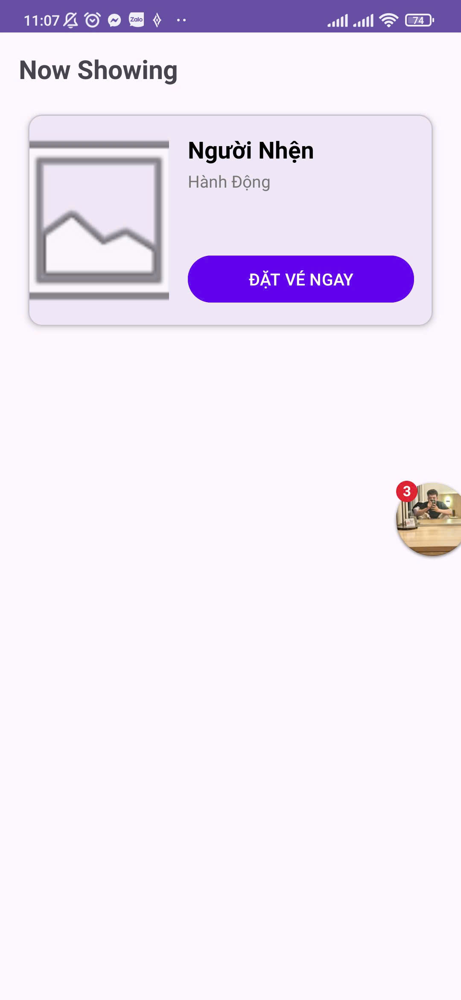
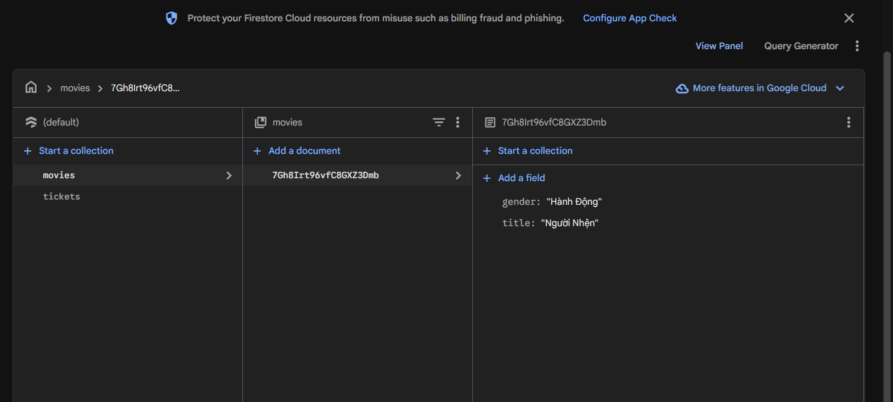
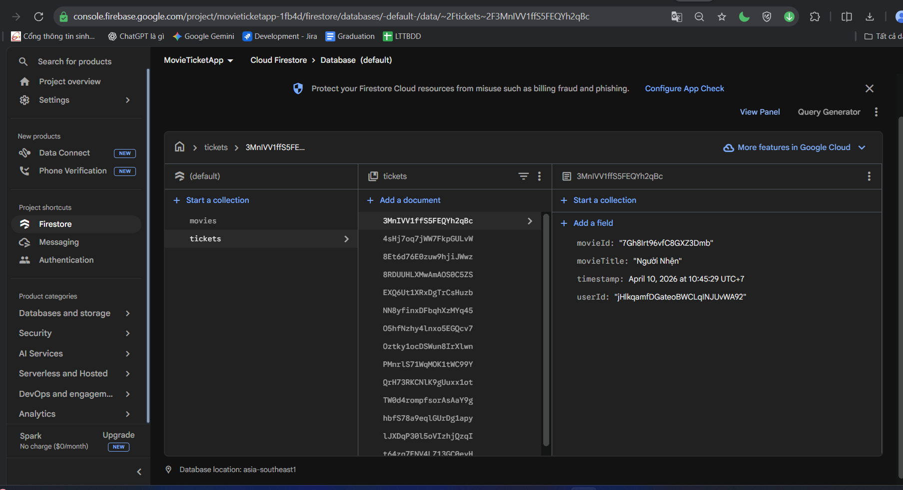

# Movie Ticket App - Firebase Integration

Ứng dụng đặt vé xem phim sử dụng Android Java và Firebase.

## Các chức năng đã hoàn thành:
* **Authentication**: Đăng ký và đăng nhập bằng Email/Password qua Firebase Auth.
* **Firestore Database**: Quản lý danh sách phim và thông tin vé đặt.
* **Push Notification**: Thông báo nhắc lịch chiếu khi đặt vé thành công.
* **Modern UI**: Giao diện CardView mượt mà, tải ảnh poster bằng Glide.

## Hình ảnh minh họa:

### 1. Giao diện ứng dụng

### 2. Cấu hình Firebase Database

### 3. Danh sách vé đã đặt

